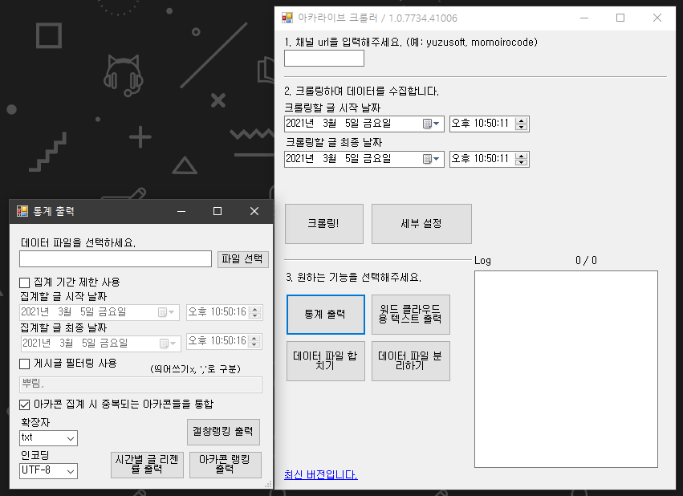

# ArcaliveCrawler / 아카라이브 크롤러

\
커뮤니티 사이트 [아카라이브](https://arca.live)용 크롤러 프로그램이자 라이브러리. 갤창랭킹을 집계하기 위해 개발했습니다.\
이 프로그램의 사용으로 생기는 문제는 사용자에게 있습니다.\
코드가 매우 난잡해서 점차 정돈해 나갈 예정..

***

**일반 사용자용 설명서**

프로그램을 다운받고 실행합니다. 여기에서 [HERE!](https://github.com/tjgus1668/ArcaliveCrawler/releases)

갤창랭킹을 출력하는 등의 작업을 하기 전에, 크롤링이란 작업이 필요합니다.
* 크롤링 데이터 파일 출력 방법
  * 1과 2를 적절하게 입력하고 조절합니다.
  * 오른쪽 체크박스 옵션들은 무슨 의미인지 모른다면, 되도록 건들지 않는 것이 좋습니다.
  * 준비가 됐으면 '크롤링!' 버튼을 클릭합니다.
  * 크롤링에는 오랜 시간이 소요됩니다. (한 달치의 경우 1~3시간 정도)
  * 크롤링이 완료되면 데이터 파일을 원하는 곳에 저장합니다.
* 크롤링 데이터 파일 사용 방법
  * 3에 있는 기능들 중, 원하는 기능을 클릭합니다.
  * 아까 만든 크롤링 데이터 파일을 불러옵니다.
  * 잠시 기다리면, 가공된 파일을 저장할 수 있습니다.
  
***

**개발자용 설명서**

프로젝트의 소스코드를 다운받아, Arcalive 폴더를 작업하는 프로젝트에 참조로 추가합니다.\
생성자 사용 예시:

    ArcaliveCrawler ac = new ArcaliveCrawler("yuzusoft");
    
검색 기능을 이용해 채널 이름을 구할 수도 있습니다.

    string str = ArcaliveCrawler.GetChannelLink("유즈소프트");
    ArcaliveCrawler ac = new ArcaliveCrawler(str);
    
게시판 크롤링 예시:

    List<string> posts = ac.CrawlBoards(startDateTime, endDateTime);

댓글 작성자, 글 내용, 댓글 내용 등의 세부적인 정보를 얻기 위해서는 다른 함수를 추가로 사용해야 합니다.\
글 크롤링 예시:

    posts = ac.CrawlPosts(posts);
    
크롤링한 결과를 직렬화 하는 예시:

    ArcaliveCrawler.SerializationPosts(posts, filename);
    
저장된 .dat 파일을 역직렬화 하는 예시:

    var posts = ArcaliveCrawler.DeserializationPosts(fileName);

제공되는 이벤트는 현재 "Print"와 "DumpText"입니다.\
둘은 "EventArg"로 "PrintCallbackArg"를 사용하며 .Str으로 전달되는 값에 접근할 수 있습니다.
